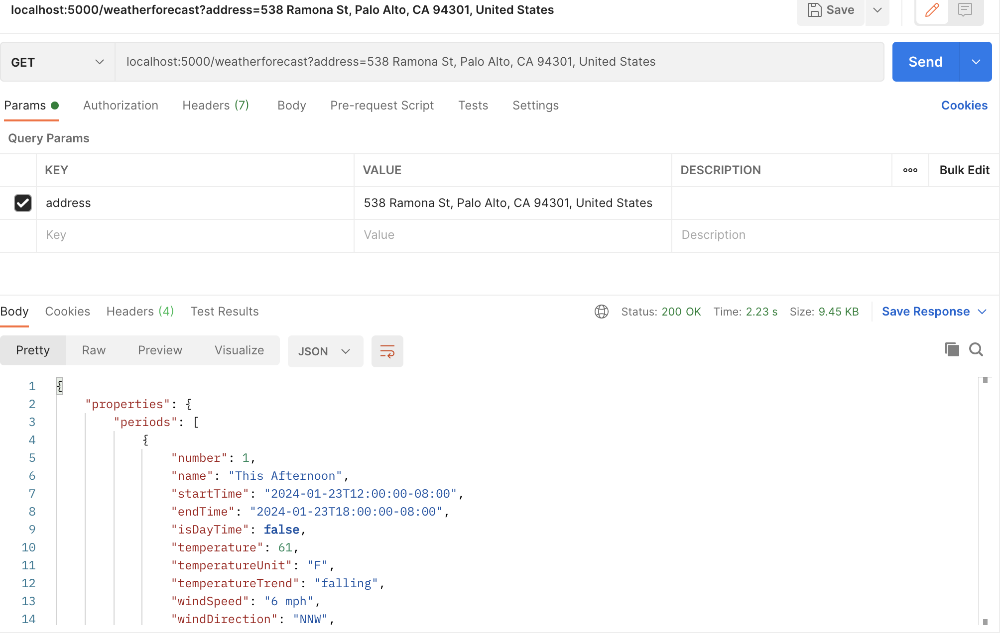

# Back End Project - SkyInsightApp

The Weather Forecast API is a backend service designed to provide accurate weather predictions for the next 7 days. Leveraging data from reliable sources, the API offers a straightforward way to retrieve weather information programmatically.

## Prerequisites

- [.NET Core SDK](https://dotnet.microsoft.com/download) installed

## Execution

Go to
`cd backend/API`

Run
`dotnet restore`

And then run
`dotnet run`

Finally, the project will be running -> http://localhost:5000

