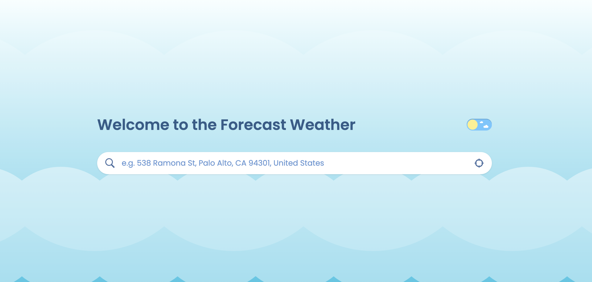
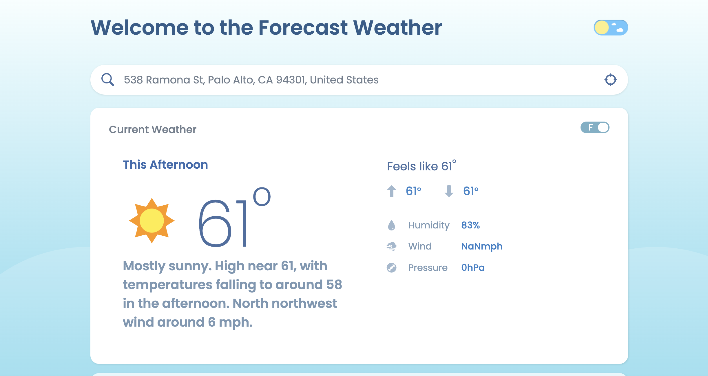

# Front End Project - SkyInsightApp

The Weather Forecast App is a frontend application built with React, providing an intuitive user interface for accessing accurate weather predictions. With a clean and modern design, users can effortlessly check the weather forecast for their desired locations.

## Prerequisites

- Make sure you have Node.js and npm installed according to your operating system -> https://nodejs.org/en

## Execution

Go to
`frontend`

Run
`npm install`

Run
`npm start`

And then, open your web browser and navigate to http://localhost:3000

